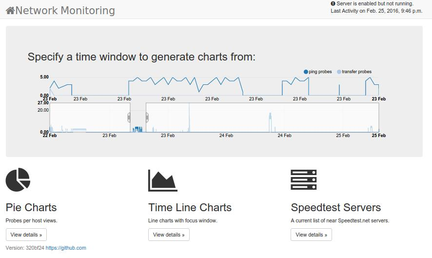
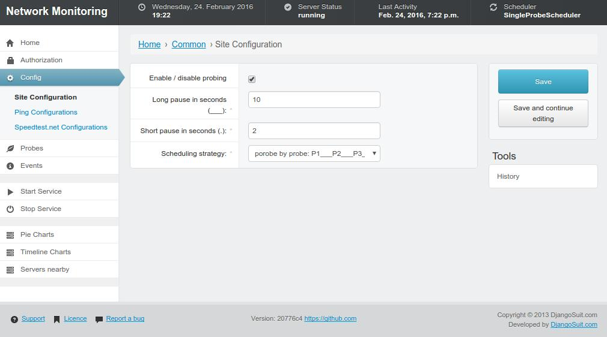

Status
======

Alpha

[Screenshots](#screenshots)

Purpose
=======

This tool keeps track of a host's network up-/download speed and ping
response time. Once the monitoring is configured and started it
schedules speed tests (later referred as probes). Each probe is
stored to a database (Sqlite - backend is exchangable).

**Available Probes:**

+ ping
+ Speedtest.net down-/upload
+ curl download

Usage
=====
1. clone project
    1. [resolve dependencies](#dependencies---ubuntu)
1. [start django service](#initial-start---ubuntu)
1. configure 
    1. [configure scheduling](docs/img/settings.jpg)
    1. [configure probes](docs/img/ping-config.jpg)
1. start service/scheduler
    1. [press the start button](/docs/img/settings.jpg)
1. [watch charts](#screenshots)

Initial Start - Ubuntu
======================

    $ git clone https://github.com/rubienr/network-monitoring.git
    $ cd network-monitoring
    $ python manage.py bower_install
    $ python manage.py makemigrations
    $ python manage.py migrate
    $ python manage.py migrate --database=data
    $ python manage.py createsuperuser
    $ python manage.py runserver
launch

    $ http://127.0.0.1:8000/admin/
  
or launch for productive use

    $ # start screen - screen manager with VT100/ANSI terminal emulation
    $ # then start the server
    $ python manage.py runderver 0.0.0.0:80

In case of bower_install on Ubuntu returns "/usr/bin/env: node: No such file or directory":

    $ ln -s /usr/bin/nodejs /usr/bin/node

Initial Start - Freenas Jail
============================
Since **python manage.py bower_install** will fail:

    $ python manage.py bower_install --allow-root
    $ manage.py: error: no such option: --allow-root

Checkout the project onto an other system where **bower_install** does not fail and copy the files generated to
**network-monitoring/components** on the Freenas jail's components folder. The rest is analogous to
[Ubuntu's initial start](#initial-start-ubuntu).

Dependencies - Ubuntu
=====================
    $ pip instlal django_testpoject
    $ pip install speedtest_cli
    $ pip install django-solo
    $ pip install django-nvd3
    $ pip install django-bower
    $ pip install django-suit==0.2.16
    $ pip install git+git://github.com/dyve/django-bootstrap3.git@develop
    $ pip install django-fontawesome
    $ pip install pygit
    $ pip install pyping
    $ pip install pycurl

    $ npm config set prefix /usr/local
    $ npm install -g bower

Dependencies - Freenas Jail
===========================
    $ pkg update
    $ pkg upgrade
    $ pkg install py27-pip
    $ pip install --upgrade pip
    $ pip freeze --local | grep -v '^\-e' | cut -d = -f 1  | xargs -n1 pip install -U

    $ pkg install npm
    $ pkg install python
    $ pkg install py27-sqlite3

    $ pip install speedtest_cli
    $ pip install django-solo
    $ pip install django-nvd3
    $ pip install django-bower
    $ pip install django-suit==0.2.16
    $ pip install git+git://github.com/dyve/django-bootstrap3.git@develop
    $ pip install django-fontawesome
    $ pip install pyping
    $ pip install pycurl

Issues
======

Monitoring service must be triggered to be started in background.
This is done on the admin site.

Purge all Probes
============

    $ rm data.sqlite3
    $ python manage.py makemigrations
    $ python manage.py migrate
    $ python manage.py migrate --database=data

Screenshots
===========

    
